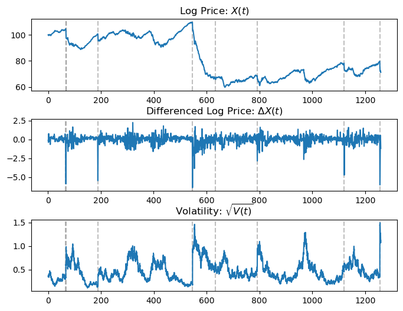
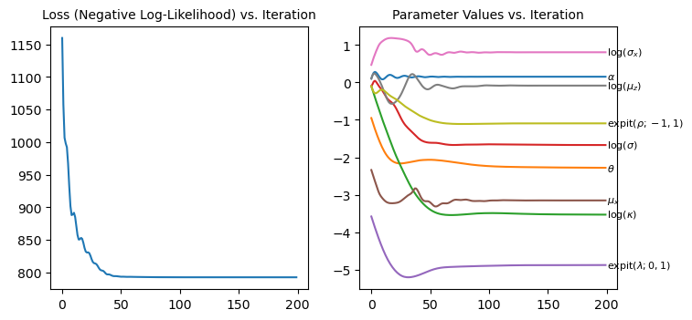
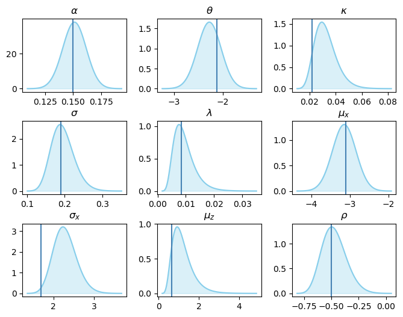

---
jupyter:
  kernelspec:
    display_name: Python 3
    language: python
    name: python3
  language_info:
    codemirror_mode:
      name: ipython
      version: 3
    file_extension: .py
    mimetype: text/x-python
    name: python
    nbconvert_exporter: python
    pygments_lexer: ipython3
    version: 3.9.18
  nbformat: 4
  nbformat_minor: 2
---


# A Differentiable Particle filter for Jump-Diffusion Stochastic Volatility Models

**Michelle Ko \-- University of Waterloo**

**May 12, 2024**


## Summary

Stochastic volatility with jump (SVJ) models are useful when describing
the stochastic and intermittently discontinuous nature of asset price
movement. These models are highly nonlinear and their likelihood
functions are often unavailable in closed-form. One approach is to
reformulate the original model as a state-space model and numerically
approximate the marginal likelihood of the parameters via a particle
filter. Particle-estimated likelihood can be combined with a Markov
Chain Monte Carlo (MCMC) method to sample from the parameter posterior,
hence the name particle MCMC; however, in multi-dimensional parameter
space, this becomes a very computationally expensive task.

Bayesian normal approximation serves as a faster alternative but
necessitates the likelihood estimate to be differentiable\-\--the
particle-estimated marginal likelihood for SVJ does not meet this
requirement due to (1) the widely used multinomial resampling technique
in particle filtering and (2) the inherent discontinuity of jumps in the
model.

This document shows how to construct a particle filter that addresses
the two issues above by (1) incorporating a multivariate normal
resampler and (2) circumventing the jump-induced discontinuity with a
customized proposal density. A comprehensive simulation study and
application to S&P 500 Index data are provided to investigate the
performance of this differentiable particle filter for parameter
inference and volatility recovery.


## Implementation


### (Multivariate) Normal Resampler

Multivariate normal (MVN) resampler is a simple resampling scheme that
offers differentiability of the filter w.r.t. the model parameters. At
each observation time, the MVN resampler calculates the weighted mean
and variance of the particles to draw a new set from the resulting MVN
distribution. While extremely fast, the MVN resampler may present bias
if the weighted particles exhibit multimodality. In this case, it
suffices to resample the volatility position atthe last
inter-observation, meaning the resampler here uses a 1D normal
distribution.


``` python
import jax
import jax.numpy as jnp
import jax.scipy as jsp
import jax.random as jrandom
from jax import lax, vmap
from jax import config
import optax
config.update("jax_enable_x64", True)

import pfjax as pf
import seaborn as sns
import matplotlib.pyplot as plt
```


``` python
def resample_mvn_1d(key, x_particles_prev, logw, var_epsilon=1e-6):
    r"""
    Particle resampler with 1D Normal approximation.

    Args:
        key: PRNG key.
        x_particles_prev: An `ndarray` with leading dimension `n_particles` consisting of the particles from the previous time step.
        logw: Vector of corresponding `n_particles` unnormalized log-weights.
        var_epsilon: A small positive scalar for variance in case of numerical instability.

    Returns:
        A dictionary with elements:
            - `x_particles`: An `ndarray` with leading dimension `n_particles` consisting of the particles from the current time step.
            - `vol_mean`: A scalar of the weighted mean (log) volatility.
            - `vol_std`: A scalar of the weighted standard deviation.
    """
    # Get weights as probability
    prob = pf.utils.logw_to_prob(logw) 
    n_particles = logw.shape[0]
    
    condition = jnp.sum(prob) > 0. # Sometimes `prob` is unstable when all particles have very small weight
    particles_tmp = x_particles_prev[:,-1,0] # [All particles, last position, volatility]
    prob_tmp = jnp.where(condition,
                         prob,
                         jnp.array([1./n_particles]*n_particles)) # if condition is not met, just equally resample
    
    # Get weighted mean and standard deviation
    vol_mean = jnp.average(particles_tmp, weights=prob_tmp)
    vol_var = jnp.average((particles_tmp - vol_mean)**2, 
                          weights=prob_tmp)
    vol_std = jnp.sqrt(jnp.where(vol_var > 0., vol_var, var_epsilon)) 

    # Resample by normal distribution
    vol_samples = vol_mean + vol_std * jrandom.normal(key, shape=(n_particles,))
    x_particles = x_particles_prev.at[:,-1,0].set(vol_samples)
    return {
        "x_particles": x_particles,
        "vol_mean": vol_mean,
        "vol_std": vol_std
    }
```


### SDE Jump Model

The following model class provides a generic skeleton for the
jump-diffusion model.


``` python
class SDEJumpModel(object):
    """
    Generic SDE Jump model. 
    """
    def __init__(self, dt, n_res):
        self._dt = dt
        self._n_res = n_res
        self._dt_res = self._dt/self._n_res
        
        def euler_sim_jump(key, x, dt, diff, jump, theta):
            """
            Simulate Jump-Diffusion SDE under Euler-Maruyama scheme.
            Args:
                key: PRNG key.
                x: Current latent state, a vector of size `n_dims`.
                dt: Time between observations, a scalar. 
                drift_diff: Drift and diffusion function that returns a vector of size `n_dims`.
                jump: Jump function that returns a vector of size `n_dims`.
                theta: Static parameters, a vector of size `n_pars`.
            Returns:
                Next latent state sample. A vector of size `n_dims`.
            """
            diff_subkey, jump_subkey = jrandom.split(key)
            diff_term = diff(diff_subkey, x, theta, dt)
            jump_term = jump(jump_subkey, x, theta, dt)
            return jnp.append(diff_term + jump_term, jump_term)
        
        def euler_sim(self, key, x, dt, theta):
            return euler_sim_jump(key, x, dt, self.diff, self.jump, theta)
        
        setattr(self.__class__, 'euler_sim', euler_sim)
    
    def state_sample(self, key, x_prev, theta):
        """
        Samples from `x_curr ~ p(x_curr | x_prev, theta)`.
        Args:
            key: PRNG key.
            x_prev: Latent state at previous time, an array of size `n_res` by `n_dim`.
            theta: Static parameters, a vector of size `n_pars`.
        Returns:
            Sample of the latent state at current time, a dictionary: 
                - "x": an array of size `n_res` by `n_dim`.
                - "key": PRNG key.
        """
        def fun(carry, t):
            key, subkey = jrandom.split(carry["key"])
            x = self.euler_sim(
                key=subkey, x=carry["x"],
                dt=self._dt/self._n_res, theta=theta
            )
            res = {"x": x, "key": key}
            return res, x
        init = {"x": x_prev[-1], "key": key}
        last, full = lax.scan(fun, init, jnp.arange(self._n_res))
        return full
```


To provide maximum modularization, the implementation of the SVJ model
requires the following 4 components:

1.  Deterministic: two methods that return the deterministic (given
    current position and parameters) components to calculate the
    diffusion and the jump (anything that does not involve a key)
2.  Stochastic: two methods that return the random variables required to
    be combined with the deterministic components above. Diffusion
    random variables are implemented already by returning 2 standard
    normal variables (one for price and another for volatility)
3.  Parameter Transformation: three methods that describe how the
    parameters can be transformed to unconstrained scale, recovered into
    original scale, and how they are named
4.  Jump Law: two methods that return the jump sizes in the price and
    volatility, and an additional volatility jump law if the jump is not
    additive


``` python
class DeterministicComponent:
    # Returns the necessary terms to calculate the drift and diffusion at current position (mu_1, mu_2, sigma_1, sigma_2, rho)
    def diff_term(self, x, param):
        raise NotImplementedError()
    # Returns the necessary terms to calculate the jump size at current position
    def jump_term(self, x, param):
        raise NotImplementedError()

class StochasticComponent:
    def diff_rv(self, key):
        # Returns a vector of 2 standard normal variables
        return jrandom.normal(key, (2,))
    def jump_rv(self, key):
        raise NotImplementedError()

class ParameterTransformation:
    # Returns a vector of parameter recovered in original scale
    def recover_param(self, param_transformed):
        raise NotImplementedError()
    # Returns a vector of parameter transformed into unconstrained scale
    def transform_param(self, param):
        raise NotImplementedError()
    # Returns a dictionary of original-scaled parameters
    def get_param(self, param_transformed):
        raise NotImplementedError()
    
class JumpLaw:
    # Returns the jump sizes by combining the deterministic and random components
    def jump_size(self, key, param, stoch: StochasticComponent, determ: DeterministicComponent):
        raise NotImplementedError()
    # An additional law on the volatility jump 
    def jump_vol_law(self, x, jv):
        raise NotImplementedError()
```


``` python
class StochVolJump(SDEJumpModel):
    """
    Stochastic volatiliy models with jumps. 
    """
    def __init__(self, dt, n_res, lambda_star,
                 stoch: StochasticComponent, 
                 determ: DeterministicComponent, 
                 jumplaw: JumpLaw,
                 epsilon = 1e-15
                 ):
        super().__init__(dt, n_res)
        self._n_state = 4 # log vol, log price, log vol jump, log price jump
        self.lambda_star = lambda_star
        self.stoch = stoch
        self.determ = determ
        self.jumplaw = jumplaw
        self.epsilon = epsilon

    def _to_matrix(self, mu_1, mu_2, sigma_1, sigma_2, rho):
        """
        Mean and (lower) Cholesky decomposition of covariance matrix for bivariate distribution.

        Returns:
            dr: A length-2 vector for the drift.
            df_chol: A 2x2 array for the Cholesky-decomposed covariance.
        """
        dr = jnp.array([mu_1, mu_2])
        df_chol = jnp.array([[sigma_1, 0.],
                             [rho*sigma_2, jnp.sqrt(1-rho**2)*sigma_2]])
        return dr, df_chol
    
    def diff(self, key, x, param, dt):
        """
        Diffusion function.

        Args:
            key: PRNG key.
            x: Initial value of the SDE.  A vector of length 4.
            param: A dictionary of parameters.
            dt: Interobservation time.

        Returns:
            A vector of length 2 for volatility and price pair after `dt` time has passed.
        """
        mu_1, mu_2, sigma_1, sigma_2, rho = self.determ.diff_term(x, param)
        dr, df_chol = self._to_matrix(mu_1, mu_2, sigma_1, sigma_2, rho)
        diff_process = x[:2] + dr*dt + jnp.matmul(df_chol*jnp.sqrt(dt), self.stoch.diff_rv(key))
        return diff_process
    
    def jump(self, key, x, param, dt):
        """
        Jump function.
        
        Args:
            key: PRNG key.
            x: Initial value of the SDE.  A vector of length 4.
            param: A dictionary of parameters.
            dt: Interobservation time.

        Returns:
            A vector of length 2 for jumps in volatility and price pair after `dt` time has passed.
        """
        bern_key, jump_key = jrandom.split(key)
        is_jump = jrandom.bernoulli(bern_key, param["lambda"]*dt)
        jv, jx = self.jumplaw.jump_size(jump_key, param, self.stoch, self.determ)
        # If jump happens, return jump sizes, otherwise return zero.
        jump_process = jnp.where(is_jump, 
                                 jnp.array([self.jumplaw.jump_vol_law(x, jv), jx]), 
                                 jnp.array([0.,0.])) 
        return jump_process
    
    def _bridge_term(self, x, y_curr, param, i, jv, jx, jxs_invcumsum):
        """
        Bridge proposal.
        
        Args:
            key: PRNG key.
            x: Initial value of the SDE.  A vector of length 4.
            y_curr: Measurement variable at current time `t`. A scalar in this case.
            param: A dictionary of parameters.
            i: An integer for i-th inter-observation.
            jv: A scalar for jump size in volatility.
            jx: A scalar for jump size in price.
            jxs_invcumsum: A vector of length `n_res` for the inverse cumulative sum of jumps in price.

        Returns:
            5 scalars for the components of the bridge proposal drifts and diffusions for volatility and price, respectively, and volatility jump size.
        """
        mu_1, mu_2, sigma_1, sigma_2, _ = self.determ.diff_term(x, param)
        k = self._n_res - i
        vol_jump = self.jumplaw.jump_vol_law(x, jv)

        # Drift
        mu_z_dt = mu_1*self._dt_res + vol_jump
        sigma_z_sqrt_dt = jnp.maximum(sigma_1*jnp.sqrt(self._dt_res), self.epsilon) # numerical stability

        # Diffusion
        mu_x_dt = (y_curr - x[1])/k + jx - jxs_invcumsum/k
        sigma_x_sqrt_dt = jnp.maximum(sigma_2*jnp.sqrt((k - 1.)/k * self._dt_res), self.epsilon) #numerical stability

        return mu_z_dt, mu_x_dt, sigma_z_sqrt_dt, sigma_x_sqrt_dt, vol_jump

    def pf_step(self, key, x_prev, y_curr, theta):
        """
        Update particle and calculate log-weight for SVJ particle filter.

        Args:
            key: PRNG key.
            x_prev: State variable at previous time `t-1`.
            y_curr: Measurement variable at current time `t`.
            theta: Parameter value.

        Returns:
            - x_curr: Sample of the state variable at current time `t`: `x_curr ~ q(x_curr)`.
            - logw: The log-weight of `x_curr`.
        """
        # Preparation
        scan_key, bern_key, perm_key, jump_size_key = jrandom.split(key, 4)
        is_jump = jrandom.bernoulli(bern_key, self.lambda_star)
        jv, jx = self.jumplaw.jump_size(jump_size_key, theta, self.stoch, self.determ)

        # Pre-determine the jump sizes, as they are independent
        is_jumps = jrandom.permutation(perm_key, jnp.append(jnp.zeros(self._n_res-1), is_jump))
        jvs = is_jumps*jv
        jxs = is_jumps*jx
        jxs_invcumsums = lax.cumsum(jxs[::-1])[::-1]
        
        scan_init = {
            "x": x_prev[-1],
            "key": scan_key,
            # Pre-weigh depending on whether the particle is jumping or not
            "lp": jnp.where(is_jump, 
                            jnp.log(theta["lambda"]*self._dt) - jnp.log(self.lambda_star),
                            jnp.log(1-theta["lambda"]*self._dt) - jnp.log(1-self.lambda_star))
        }

        def scan_fun(carry, t):
            key = carry["key"]
            x = carry["x"]

            # Necessary components for the transition density
            i, jv, jx, jxs_invcumsum = t
            mu_1, mu_2, sigma_1, sigma_2, rho = self.determ.diff_term(x, theta)
            key, diff_key = jrandom.split(key)

            # Necessary components for the proposal density
            mu_z_dt, mu_x_dt, sigma_z_sqrt_dt, sigma_x_sqrt_dt, vol_jump = self._bridge_term(x, y_curr, theta, i, jv, jx, jxs_invcumsum)

            # Delta in price and volatility after `dt` time has passed according to bridge proposal
            b1, b2 = self.stoch.diff_rv(diff_key)
            dx2 = mu_x_dt + sigma_x_sqrt_dt * b2
            # Calculate Delta volatility given Delta price (conditional 1D normal from bivariate normal)
            dx1 = mu_z_dt + rho * sigma_1/sigma_2 * (dx2 - (mu_2*self._dt_res + jx)) + sigma_1*jnp.sqrt((1.-rho**2)*self._dt_res) * b1

            # Log-probability from proposal density
            lp_prop = jnp.where(i<self._n_res-1,
                                jsp.stats.norm.logpdf(x = dx2,
                                                      loc = mu_x_dt,
                                                      scale = sigma_x_sqrt_dt),
                                0.0) # Delta function when last inter-observation.
            
            # Log-probability from transition density
            lp_trans = jsp.stats.norm.logpdf(x = dx2,
                                             loc = mu_2 * self._dt_res + jx,
                                             scale = sigma_2 * jnp.sqrt(self._dt_res))
            
            # Next position (after dt) drawn from proposal density
            x_prop = jnp.array([jnp.maximum(x[0] + dx1, jnp.log(self.epsilon)), x[1]+dx2])

            # Position, key and incremental log-weight
            res_carry = {
                "x": jnp.concatenate((x_prop, jnp.array([vol_jump, jx]))),
                "key": key,
                "lp": carry["lp"] + lp_trans - lp_prop
            }

            res_stack = {"x": res_carry["x"], "lp": res_carry["lp"]}

            return res_carry, res_stack
        
        last, full = lax.scan(scan_fun, scan_init, (jnp.arange(self._n_res), jvs, jxs, jxs_invcumsums))
        x_prop = full["x"]

        return x_prop, last["lp"]

    def pf_init(self, key, y_init, theta):
        """
        Initialize for calling `pf_step`.

        Args:
            key: PRNG key.
            y_init: Measurement variable at initial time `t = 0`.
            theta: Static parameters, a vector of size `n_pars`.

        Returns:
            Tuple:
                - **x_init** - A sample from the proposal distribution for `x_init`.
                - **logw** - The log-weight of `x_init`.
        """
        init_x_state = jnp.array([theta["theta"] + (theta["sigma"] / jnp.sqrt(2*theta["kappa"])) *jrandom.normal(key), y_init, 0.,0.])
        logw = 0.
        return \
            jnp.append(jnp.zeros((self._n_res-1,) + (self._n_state, )),
                       jnp.expand_dims(init_x_state, axis = 0), axis=0), \
            logw

    def meas_sample(self, key, x_curr, theta):
        """
        Sample from the error-free measurement model.

        Args:
            key: PRNG key.
            x_curr: Current latent state, an array of size `n_res` by `n_dim`.
            theta: Static parameters, a vector of size `n_pars`.

        Returns:
            Sample of the observation at current time, a scalar.
        """
        return x_curr[-1][1]
    
```


### Optimization over Particle-Estimated Likelihood

The objective function for the optimization problem here is the negative
log-likelihood estimate from particle filtering. To employ
gradient-based optimization technique, this must return a differentiable
quantity.


``` python
def pf_objective_full(param_transformed, model, key, y_meas, resampler, transform, n_particles=300):
    """
    Objective function for the optimization problem.

    Args:
        param_transformed: A vector of transformed parameters.
        model: Object specifying the state-space model having the following methods:

            - `pf_init : (key, y_init, theta) -> (x_particles, logw)`: For sampling and calculating log-weights for the initial latent variable.
            - `pf_step : (key, x_prev, y_curr, theta) -> (x_particles, logw)`: For sampling and calculating log-weights for each subsequent latent variable.
            - `pf_aux : (x_prev, y_curr, theta) -> logw`: Optional method providing look-forward log-weights of the auxillary particle filter.
            - `state_lpdf : (x_curr, x_prev, theta) -> lpdf`: Optional method specifying the log-density of the state model.  Only required if `score or fisher == True`.
            - `meas_lpdf : (y_curr, x_curr, theta) -> lpdf`: Optional method specifying the log-density of the measurement model.  Only required if `score or fisher == True`.
        key: PRNG key.
        y_meas: JAX array with leading dimension `n_obs` containing the measurement variables `y_meas = (y_0, ..., y_T)`, where `T = n_obs-1`.
        resampler: Function used at step `t` to obtain sample of particles from `p(x_{t} | y_{0:t}, theta)` out of a sample of particles from `p(x_{t-1} | y_{0:t-1}, theta)`.   The argument signature is `resampler(x_particles, logw, key)`, and the return value is a dictionary with mandatory element `x_particles`  and optional elements that get carried to the next step `t+1` via `lax.scan()`.
        transform: Object specifying transformation and recovery of parameters.
        n_particles: Number of particles.

    Returns:
        A scalar for the negative particle-estimated marginal log-likelihood.
    """
    # Prepare parameters
    param = transform.recover_param(param_transformed)
    param_dict = transform.vec_to_dict(param)
    # MVN resampler-backed particle filtering
    pf_mvn = pf.particle_filter(
            model=model,
            key=key,
            y_meas=y_meas,
            theta=param_dict,
            n_particles=n_particles,
            resampler=resampler,
        )
    # Negative log-likelihood
    negloglik = -pf_mvn["loglik"]
    return negloglik

def fit(param, key, optimizer, iter, model, y_meas, resampler, transform):
    """
    Run the optimization.

    Args:
        param: A vector of transformed parameters.
        key: PRNG key.
        optimizer: An Optax optimizer.
        iter: Number of optimization iterations.
        model: Object specifying the state-space model for the `particle_filter` method.
        y_meas: JAX array with leading dimension `n_obs` containing the measurement variables `y_meas = (y_0, ..., y_T)`, where `T = n_obs-1`.
        resampler: Function used at step `t` to obtain sample of particles from `p(x_{t} | y_{0:t}, theta)` out of a sample of particles from `p(x_{t-1} | y_{0:t-1}, theta)`.   The argument signature is `resampler(x_particles, logw, key)`, and the return value is a dictionary with mandatory element `x_particles`  and optional elements that get carried to the next step `t+1` via `lax.scan()`.
        transform: Object specifying transformation and recovery of parameters.

    Returns:
        Dictionary:
            - param: An array with leading dimension `iter` with parameter update history across iterations.
            - loss_value: A vector of length `iter` with objective function value across iterations.
            - grads: An array with leading dimension `iter` with gradient history across iterations.
    """
    def step(carry, x):
        param = carry["param"]
        opt_state = carry["opt_state"]
        loss_value, grads = jax.value_and_grad(pf_objective_full)(param, model, x, y_meas, resampler, transform)
        updates, opt_state = optimizer.update(grads, opt_state, param)
        param = optax.apply_updates(param, updates)
        return {"param": param, "opt_state": opt_state}, {"param": param, "loss_value": loss_value, "grads": grads}
    
    last, full = jax.lax.scan(f=step, init={"param": param, "opt_state": optimizer.init(param)}, 
                              xs=jnp.array([key]*iter)
                              )
    return full
```


## Simulation Study

The SVJ model of interest here is the Exponential Ornstein-Uhlenbeck (ExpOU) model with contemporaneous jumps, given by

$$
\begin{aligned}
    &d X(t) = (\alpha - 0.5 V(t)) d t + \sqrt{V(t)} d B^S (t) + J^X(t) d N_{\lambda}(t) \\  
    &d Z(t) = \kappa(\theta - Z(t)) dt + \sigma d B^V (t) + J^Z(t) d N_{\lambda}(t) \\
    & J^X (t) \sim N(\mu_x, \sigma_x^2), (e^{J^Z (t)}-1) V(t) \sim Expo(1/\mu_z) \\
    &\mathrm{Corr}(d B_S(t), d B_V(t)) = \rho,
\end{aligned}
$$

where $X(t)$ and $Z(t)$ represent the log asset price and log volatility (variance), respectively. The model parameters are thus

$$
\begin{equation*}
    \boldsymbol{\theta} = (\alpha, \theta, \kappa, \sigma, \lambda, \mu_x, \sigma_x, \mu_z, \rho).
\end{equation*}
$$

``` python
# ExpOU Deterministic Component
class ExpOUDeterministicComponent(DeterministicComponent):
    def diff_term(self, x, param):
        vol = jnp.exp(x[0])   
        mu_1 = param["kappa"]*(param["theta"]-x[0])
        mu_2 = param["alpha"] - vol/2
        sigma_1 = param["sigma"]
        sigma_2 = jnp.sqrt(vol)
        rho = param["rho"]
        return mu_1, mu_2, sigma_1, sigma_2, rho
    
    def jump_term(self, param):
        return param["mu_z"], param["mu_x"], param["sigma_x"]

# ExpOU Stochatic Component
class ExpOUStochasticComponent(StochasticComponent):
    def jump_rv(self, key):
        keys = jrandom.split(key)
        return jrandom.exponential(keys[0]), jrandom.normal(keys[1])

# ExpOU Parameter Transformation
class ExpOUParameterTransofrmation(ParameterTransformation):
    def vec_to_dict(self, param):
        d = {
            "alpha": param[0],
            "theta": param[1],
            "kappa": param[2],
            "sigma": param[3],
            "lambda": param[4],
            "mu_x": param[5],
            "sigma_x": param[6],
            "mu_z": param[7],
            "rho": param[8]
        }
        return d        
    
    def dict_to_vec(self, param):
        v = jnp.array([param["alpha"],
                       param["theta"],
                       param["kappa"],
                       param["sigma"],
                       param["lambda"],
                       param["mu_x"],
                       param["sigma_x"],
                       param["mu_z"],
                       param["rho"]
                       ])
        return v 
    
    def recover_param(self, param_transformed):
        v = jnp.array([param_transformed[0],
                       param_transformed[1],
                       jnp.exp(param_transformed[2]),
                       jnp.exp(param_transformed[3]),
                       jsp.special.expit(param_transformed[4]),
                       param_transformed[5], 
                       jnp.exp(param_transformed[6]),
                       jnp.exp(param_transformed[7]),
                       (jnp.exp(param_transformed[8])-1.)/(jnp.exp(param_transformed[8])+1.)
                       ])
        return v

    def transform_param(self, param):
        v = jnp.array([param[0],
                       param[1],
                       jnp.log(param[2]),
                       jnp.log(param[3]),
                       jnp.log(param[4])-jnp.log(1.-param[4]),
                       param[5], 
                       jnp.log(param[6]),
                       jnp.log(param[7]),
                       jnp.log(param[8]+1.)-jnp.log(1.-param[8])
                       ])
        return v

class ExpOUJumpLaw(JumpLaw):
    def jump_size(self, key, param, stoch: StochasticComponent, determ: DeterministicComponent):
        expo_rv, norm_rv = stoch.jump_rv(key)
        mu_z, mu_x, sigma_x = determ.jump_term(param)
        return mu_z*expo_rv, mu_x + sigma_x*norm_rv

    def jump_vol_law(self, x, jv):
        vol = jnp.exp(x[0])
        return jnp.log(1. + jv/vol)
```

Using the following configuration, a synthetic dataset is generated.

``` python
# Settings
my_key = jrandom.PRNGKey(14389470)
my_normal_key = jrandom.PRNGKey(2349)
my_inference_key = jrandom.PRNGKey(29781)
my_dt = 1.
my_n_res = 10
my_n_obs = 252 * 5 # trading days in years
my_lambda_star = 0.3

# ExpOU Model
expou = StochVolJump(my_dt,my_n_res,my_lambda_star,
                    ExpOUStochasticComponent(),
                    ExpOUDeterministicComponent(), 
                    ExpOUJumpLaw())

# True parameter values
my_expou_param = jnp.array([0.15, jnp.log(0.12), 0.022, 0.19, 
                            0.0084, -3.1, 1.7, 0.65,
                            -0.5])
expou_transform = ExpOUParameterTransofrmation()
my_expou_param_dict = expou_transform.vec_to_dict(my_expou_param)

# Initialize
my_x_init = jnp.block([[jnp.zeros((my_n_res-1, 4))],
                [jnp.array([my_expou_param_dict['theta'] + 
                            my_expou_param_dict['sigma']*jnp.sqrt(2*my_expou_param_dict['kappa'])*jrandom.normal(my_normal_key), 
                            100.0,
                            0.0,
                            0.0])]])

y_meas, x_state = pf.simulate(expou, my_key, my_n_obs, my_x_init, my_expou_param_dict)
```

``` python
# Simulation Data
t_day = jnp.arange(len(y_meas))
t_intraday = jnp.linspace(start=1./my_n_res, stop=(len(y_meas)-1), num=(len(y_meas)-1)*my_n_res)

fig, ax = plt.subplots(nrows=3, ncols=1, figsize=(8, 6), gridspec_kw={'hspace': 0.4})

for j in range(3):
    for i, val in enumerate(x_state[1:,:,2].flatten()):
        if val > 0.:
            ax[j].axvline(i/my_n_res, color='grey', alpha=0.5, linestyle='--')

sns.lineplot(x=t_day, y=(y_meas), ax=ax[0]).set(title = r"Log Price: $X(t)$")
sns.lineplot(x=t_day[1:], y=jnp.diff(y_meas), ax=ax[1]).set(title = r"Differenced Log Price: $\Delta X(t)$")
sns.lineplot(x=t_intraday, y=jnp.exp(x_state[1:,:,0]/2).flatten(), ax=ax[2]).set(title = r"Volatility: $\sqrt{V(t)}$")

plt.show()
```



An educated guess for the parameter starting point can be made from the data.

``` python
# Stylized facts
log_ret = jnp.diff(y_meas)
worst_prob = 0.03
worst_log_ret = log_ret[log_ret< jnp.quantile(log_ret, worst_prob)]

init_theta = {
    "alpha": 0.,
    "theta": jnp.log(jnp.var(log_ret)),
    "kappa": 0.,
    "sigma": 0.,
    "lambda": jsp.special.logit(worst_prob),
    "mu_x": jnp.mean(worst_log_ret),
    "sigma_x": jnp.log(jnp.std(worst_log_ret)),
    "mu_z": 0.,
    "rho": 0.
}

init_theta_vec = expou_transform.dict_to_vec(init_theta)
```

With a learning rate scheduler, Adam from optax is used for a
single-seed optimization over the ExpOU model parameters.

``` python
lr = 1e-1
scheduler = optax.exponential_decay(
    init_value=lr,
    transition_steps=1000,
    decay_rate=0.01)

test = fit(init_theta_vec, my_inference_key, optax.adam(learning_rate=scheduler), 200, 
            expou, y_meas, resample_mvn_1d, expou_transform)
```

``` python
param_names = [r"$\alpha$", r"$\theta$", "$\log (\kappa)$",r"$\log (\sigma)$", 
               r"$\text{expit} (\lambda; 0,1)$", 
               r"$\mu_x$", r"$\log (\sigma_x)$", r"$\log (\mu_z)$", r"$\text{expit} (\rho; -1,1)$"]

param_names_original = [r"$\alpha$", r"$\theta$", "$\kappa$",r"$\sigma$", 
               r"$\lambda$", 
               r"$\mu_x$", r"$\sigma_x$", r"$\mu_z$", r"$\rho$"]
fig, ax = plt.subplots(nrows=1, ncols=2, figsize=(8, 3.75), gridspec_kw={'hspace': 0.4, })
sns.lineplot(test['loss_value'], ax=ax[0]).set_title("Loss (Negative Log-Likelihood) vs. Iteration", fontsize=10)
for i in range(9):
    sns.lineplot(data=test['param'][:, i], label=param_names[i], ax=ax[1])
    buffer = -0.2 if (i == 2 or i == 7) else 0.2
    ax[1].text(test['param'].shape[0], test['param'][-1, i], param_names[i], verticalalignment='center', fontsize=8)
ax[1].set_title("Parameter Values vs. Iteration", fontsize=10)
ax[1].legend().remove()

plt.show()
```



The optimization results along with the Hessian matrix is calculated as
the following:

``` python
my_raw_param_opt = test["param"][jnp.argmin(test['loss_value'])]
my_hess = jax.hessian(pf_objective_full)(my_raw_param_opt, expou, my_inference_key, y_meas, resample_mvn_1d, expou_transform)
my_raw_se = jnp.sqrt(jnp.diag(jnp.linalg.inv(my_hess)))
```

Bayesian Normal Approximation gives the parameter posteriors built with
the mode and the quadrature obtained above.

``` python
fig, ax = plt.subplots(nrows=3, ncols=3, figsize=(8, 6), gridspec_kw={'hspace': 0.4, 'wspace':0.3})
raw_param_range = jax.vmap(lambda m,s: jnp.linspace(m-4.*s, m+4.*s,num=100))(my_raw_param_opt, my_raw_se)
norm_pdf = jax.vmap(lambda x, m, s: jsp.stats.norm.pdf(x, loc=m, scale=s))(raw_param_range, my_raw_param_opt, my_raw_se)

for n in range(9):
    i,j = divmod(n, 3)
    sns.lineplot(x=expou_transform.recover_param(raw_param_range)[n],y=norm_pdf[n], ax=ax[i,j], 
                 color="skyblue").set(title = param_names_original[n])
    ax[i,j].axvline(my_expou_param[n], color="steelblue")
    ax[i,j].fill_between(expou_transform.recover_param(raw_param_range)[n], norm_pdf[n], color="skyblue", alpha=0.3)
```




